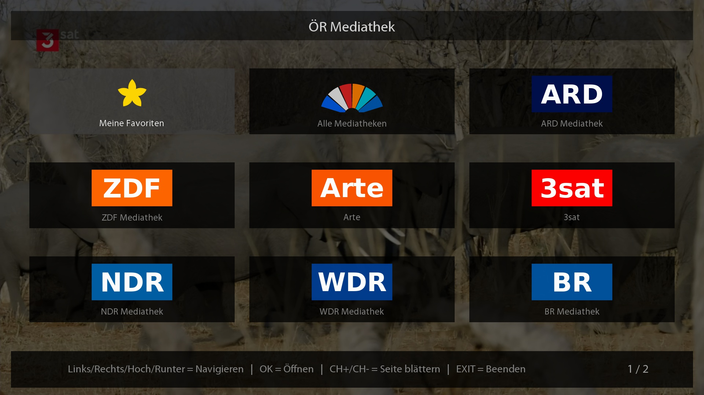
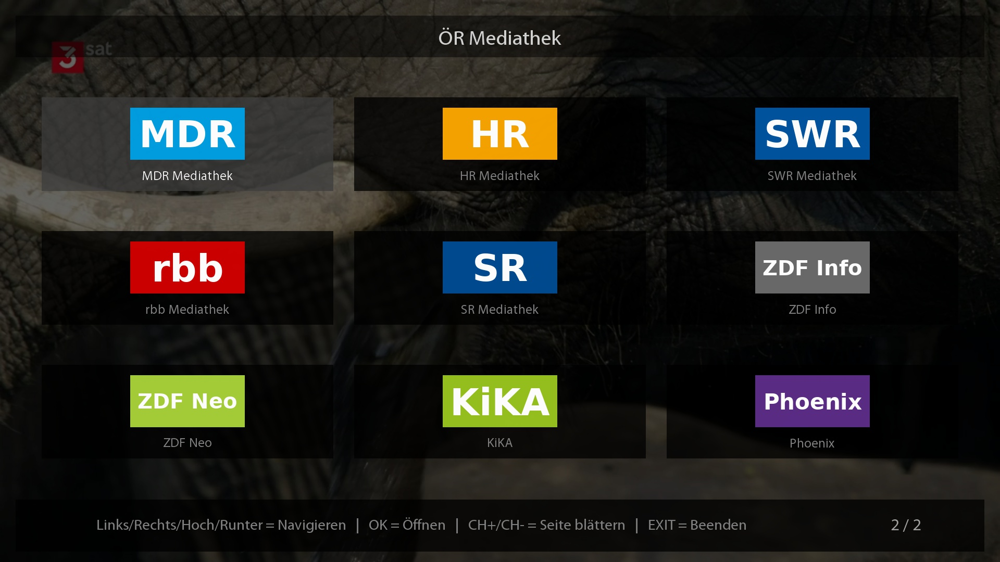
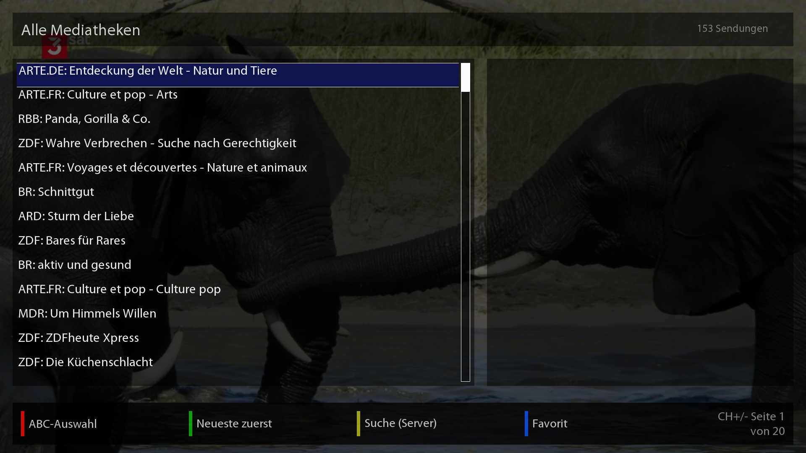
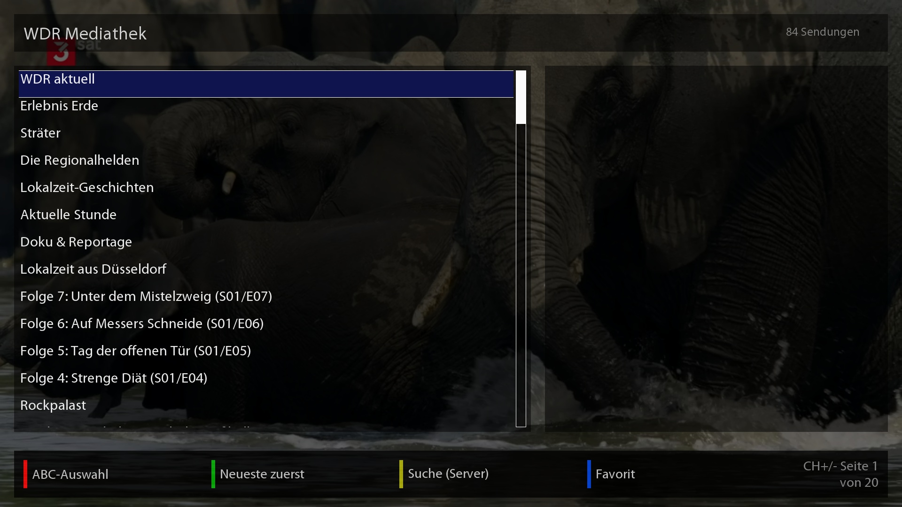
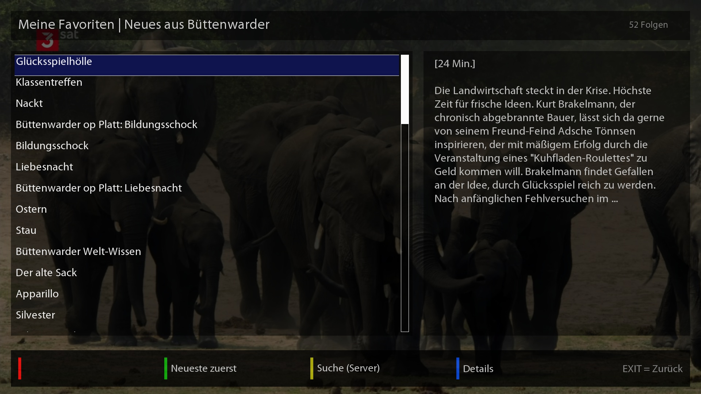
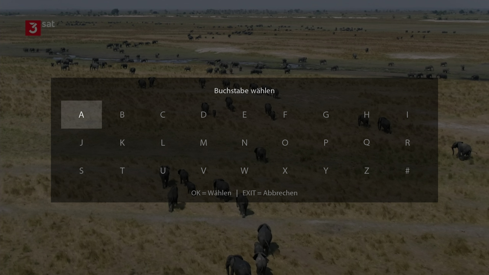
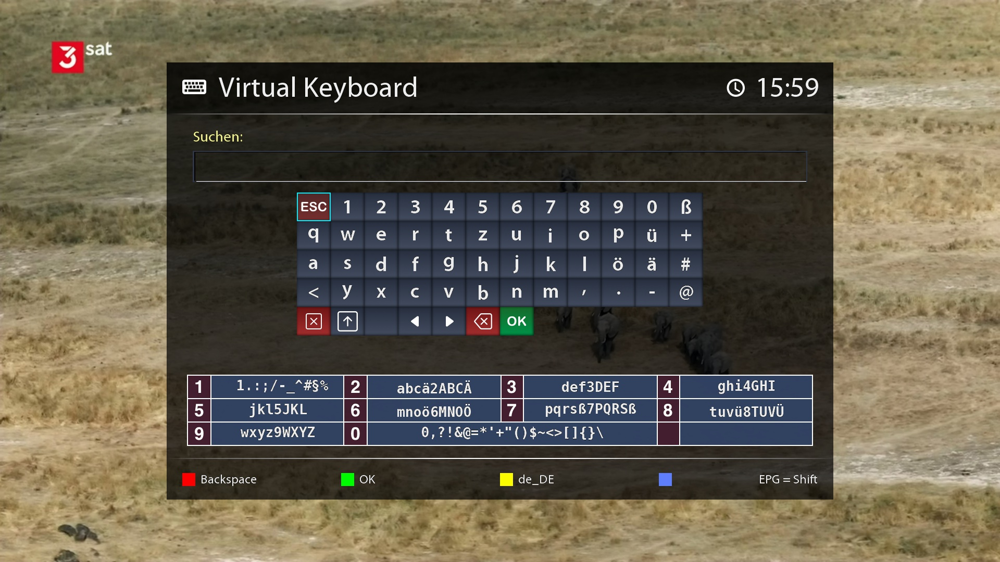
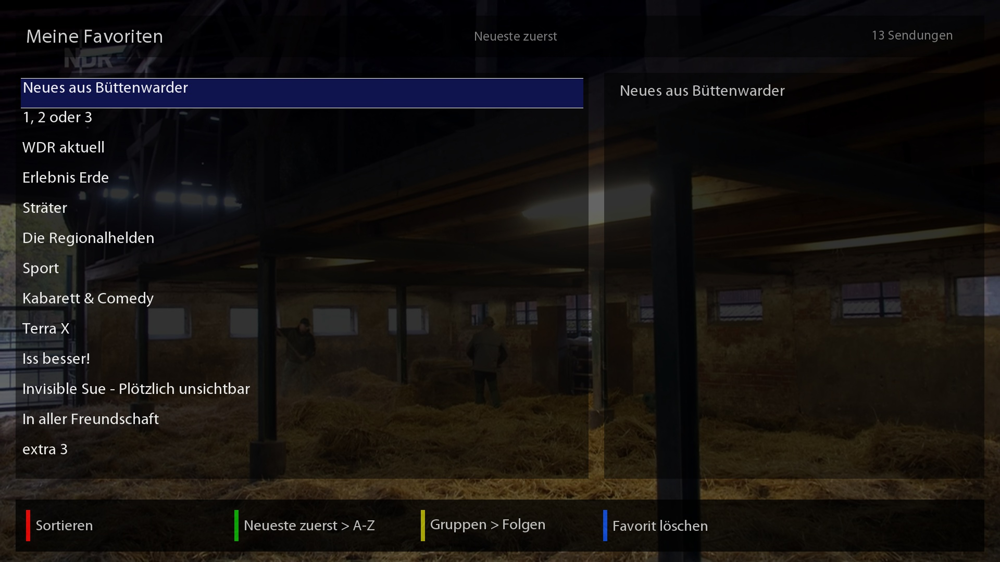
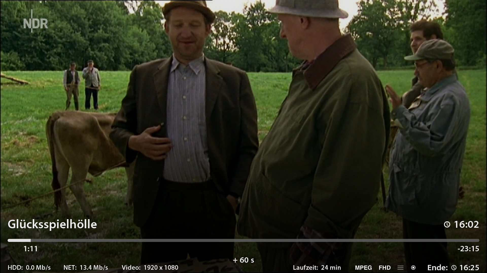

# ÖR Mediathek – Enigma2-Plugin

Enigma2-Plugin (Python 2) zum Streamen der öffentlich-rechtlichen Mediatheken auf VU+ Receivern.

Inhalte aller deutschen öffentlich-rechtlichen Sender stehen über die gemeinsame Suche zur Verfügung. Folgende Sender haben zusätzlich eine eigene Mediathek-Ansicht: ARD, ZDF, Arte, 3sat, NDR, WDR, BR, MDR, HR, SWR, RBB, SR, ZDFinfo, ZDFneo, KiKA, Phoenix, Radio Bremen, funk, ARD alpha, ONE, tagesschau24, DW

---

## Screenshots

<table>
  <tr>
    <td><br/>Hauptmenü</td>
    <td><br/>Hauptmenü (weitere Sender)</td>
  </tr>
  <tr>
    <td><br/>Alle Mediatheken</td>
    <td><br/>Sender-Mediathek geöffnet</td>
  </tr>
  <tr>
    <td><br/>Serien-Folgenübersicht</td>
    <td><br/>A-Z Sortierung</td>
  </tr>
  <tr>
    <td><br/>Suche</td>
    <td><br/>Favoriten</td>
  </tr>
  <tr>
    <td><br/>Stream aktiv</td>
    <td></td>
  </tr>
</table>

---

## Funktionen

### Inhalts-Screen

| Taste | Funktion |
|-------|----------|
| OK | Gruppe öffnen / Folge abspielen |
| Rot | Zurück zur Gruppenansicht / ABC-Auswahl |
| Grün | A-Z Sortierung |
| Gelb | Suche (Bildschirmtastatur) |
| Blau | Download (Episodenansicht) / Favoriten (Gruppenansicht) |
| EXIT | Zurück / Filter aufheben (Sendung verpasst? / Demnächst) |
| CH+ / CH- | Seitenweise blättern (bis zu 500 Einträge pro Abruf) |

### Hauptmenü

| Taste | Funktion |
|-------|----------|
| Rot | Sortiermodus (Kacheln umsortieren) |
| Grün | Einstellungen |
| Gelb | Download-Manager (nur sichtbar wenn Downloads aktiv) |
| CH+ / CH- | Zwischen Seiten wechseln |

- **Sendung verpasst?:** Erster Eintrag in jeder Mediathek — zeigt alle Sendungen eines wählbaren Tages (bis zu 8 Tage zurück)
- **Demnächst:** Zweiter Eintrag in jeder Mediathek — zeigt geplante Sendungen der nächsten 7 Tage
- **Sortiermodus:** Kacheln im Hauptmenü per OK greifen und ablegen; Reihenfolge wird gespeichert und überlebt Neustarts
- **HD/SD-Auswahl:** Wenn ein Beitrag in HD und SD verfügbar ist, wird vor dem Abspielen gefragt
- **Download:** Episoden direkt auf die Festplatte laden; läuft im Hintergrund weiter wenn der Screen per Gelb geschlossen wird
- **Download-Warteschlange:** Mehrere Downloads können nacheinander gestartet werden und laufen automatisch der Reihe nach ab
- **Download-Manager:** Zeigt laufenden Download mit Fortschritt und alle wartenden Downloads; Abbrechen einzeln oder gesamt möglich
- **Einstellungen:** Speicherort für Downloads und Kachel-Reihenfolge zurücksetzen
- **Favoriten:** Beiträge können als Favoriten gespeichert und über den Favoritenbereich aufgerufen werden
- **Hintergrundfetch:** Inhalte werden im Hintergrund geladen, die Oberfläche bleibt bedienbar

---

## Voraussetzungen

- Enigma2-Receiver mit **Python 2** (getestet auf VU+ Uno 4K SE mit VTi 15.0.04)
- Internetverbindung
- Skin mit OSD-Auflösung 1920×1080 (FHD) oder 1280×720 (HD) – wird automatisch erkannt

---

## Installation

### Per IPK (empfohlen)

Die aktuelle ZIP-Datei aus dem [Releases-Bereich](../../releases) herunterladen, entpacken und die IPK-Datei auf die Box übertragen (z.B. per FTP nach `/tmp/`), dann auf der Box:

```
opkg install enigma2-plugin-extensions-oemediathek_1.3.2_all.ipk
```

Anschließend Enigma2 neu starten.

### Manuell per FTP

Den Ordner `OeMediathek/` auf die Box in folgendes Verzeichnis kopieren:

```
/usr/lib/enigma2/python/Plugins/Extensions/OeMediathek/
```

Anschließend Enigma2 neu starten.

---

## Logos

Die im Plugin verwendeten Sender-Logos sind eigenerstellt mit **DejaVu Sans Bold** als Schriftart. Auf die Nutzung offizieller Sender-Logos wurde bewusst verzichtet, um Urheberrechtsprobleme zu vermeiden.

---

## Datenquelle

Alle Inhalte werden über die API von [mediathekviewweb.de](https://mediathekviewweb.de) ([GitHub](https://github.com/mediathekview/mediathekviewweb)) abgerufen. Die Nutzung wurde mit den Betreibern abgestimmt.

---

## Lizenz

[GNU General Public License v2.0](LICENSE)
